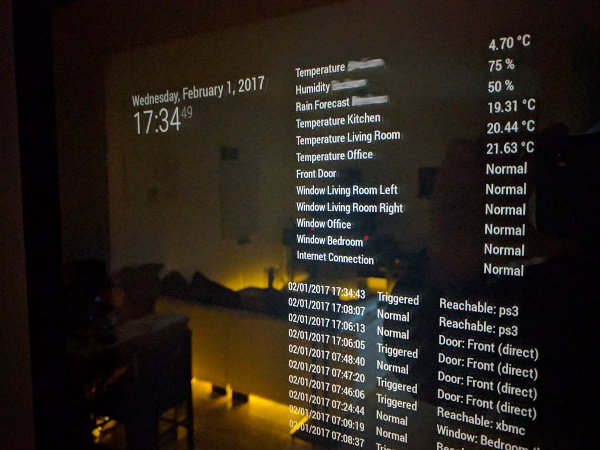
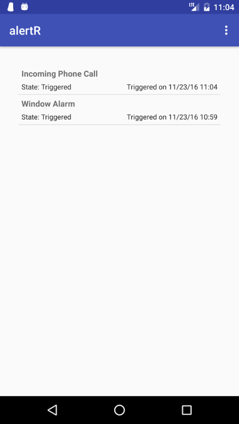
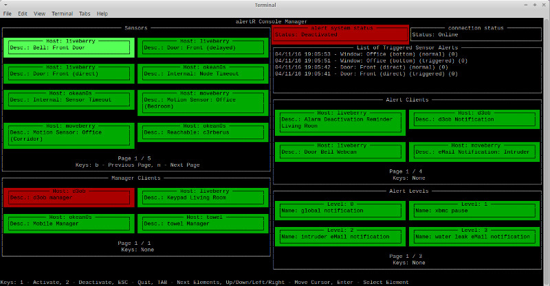
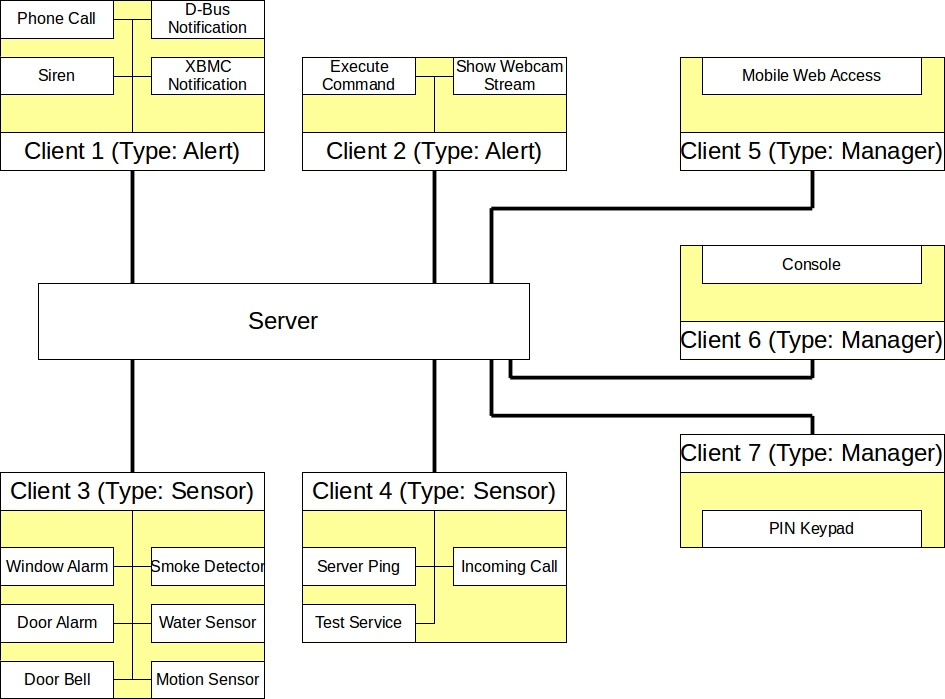

# alertR

alertR is a client/server based alarm and monitoring system. Originally it was developed as an open source home security system, but soon it became apparent that it can be used in a great variety of scenarios where an alarm or monitoring system is needed, for example as a simpler nagios to monitor the availability of a server/service.

# Table of Contents
* [Version](#version)
* [Media](#media)
  * [Pictures](#media_pictures)
  * [Videos](#media_videos)
* [Installation](#installation)
* [Update](#update)
* [Further Notes](#further_notes)
* [Supporting alertR](#supporting_alertr)
* [Bugs and Feedback](#bugs_and_feedback)

# Version
<a name="version"/>

The current stable version of alertR is 0.5. The development of alertR is done in the dev-branch. So if you want to see the next features or just check if the project is still alive, please see the commits in the dev-branch. If you want to see what has changed during the releases, you can check the [Changelog File](CHANGELOG.md).

# Media
<a name="media"/>

If you have no idea what alertR actually is or how you can use it, this section might give you some ideas.

## Pictures
<a name="media_pictures"/>

A picture of a [MagicMirror](https://magicmirror.builders/) showing alertR system information.

 

The following shows a screenshot of the [Android app](https://play.google.com/store/apps/details?id=de.alertr.alertralarmnotification) introduced in version 0.5.

 

A screenshot of the console manager in version 0.4.

 

An overview of the infrastructure a basic alertR setup has.

 

## Videos
<a name="media_videos"/>

A short preview of the alertR alarm and monitoring system in version 0.5. It shows the new alertR Android app that is able to receive push notifications. Please activate the subtitles to see the description of what I am doing and what is happening.

 

Part of one release was a rule engine, which allows you to set up rules that must be satisfied before an alarm is triggered. Again, the subtitles have to be activated in order to understand what is happening.

 

The next video was published in December 2014 and shows version 0.2 of alertR. It demonstrates the D-Bus and Kodi (aka XBMC) notification capabilities. Again, the subtitles have to be activated in order to understand what is happening.

 

The following video is a short introduction video of alertR as a home alarm system. It was the first video showing alertR. The subtitles have to be activated in order to understand what is happening.

 

# Installation
<a name="installation"/>

To install an alertR client or the alertR server, please use the installation script. A detailed description of how to install an alertR instance is given in the [Installation](https://github.com/sqall01/alertR/wiki/Installation) section of the wiki.

# Update
<a name="update"/>

If you have already a working alertR system installed and a newer version is available, use the update script to update your alertR instances. A detailed description of how to update an alertR instance is given in the [Update](https://github.com/sqall01/alertR/wiki/Update) section of the wiki.

# Further Notes
<a name="further_notes"/>

If you are interested in alertR and its development, you can also read alertR related articles in my [Blog](http://h4des.org/blog/index.php?/categories/22-alertR).

# Supporting alertR
<a name="supporting_alertr"/>

If you like this project you can help to support it by contributing to it. You can contribute by writing tutorials, creating and documenting exciting new ideas to use alertR, writing code for it, and so on.

If you do not know how to do any of it, you can support the project by [donating](https://alertr.de/donations.php). Since services such as the push notification service have a monthly upkeep, the donation helps to keep these services free for everyone.

# Bugs and Feedback
<a name="bugs_and_feedback"/>

For questions, bugs and discussion please use the [Github Issues](https://github.com/sqall01/alertR/issues).